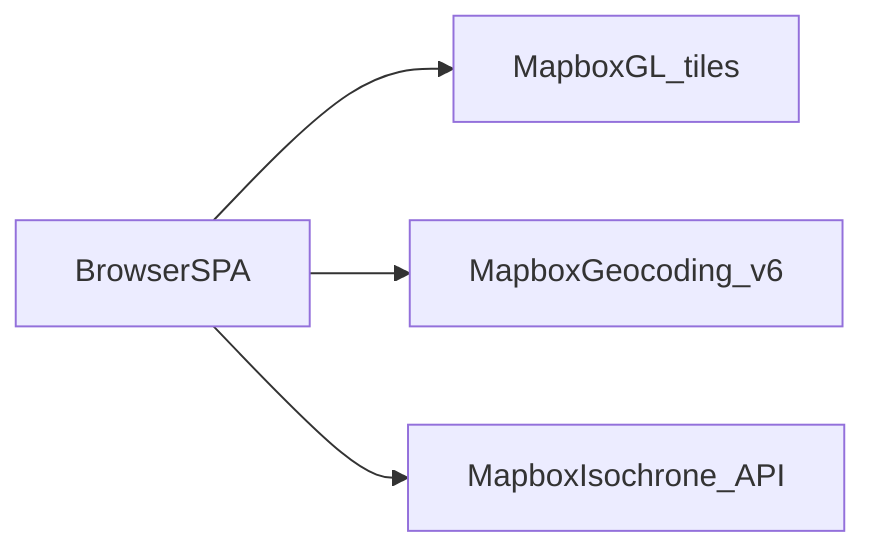
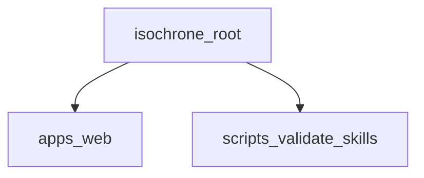
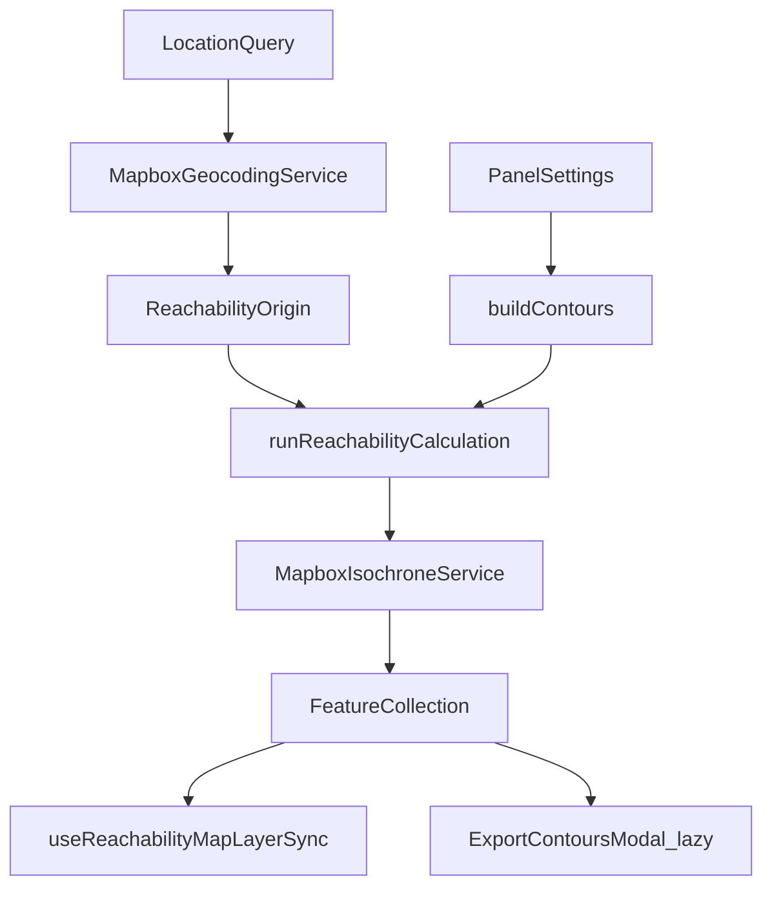
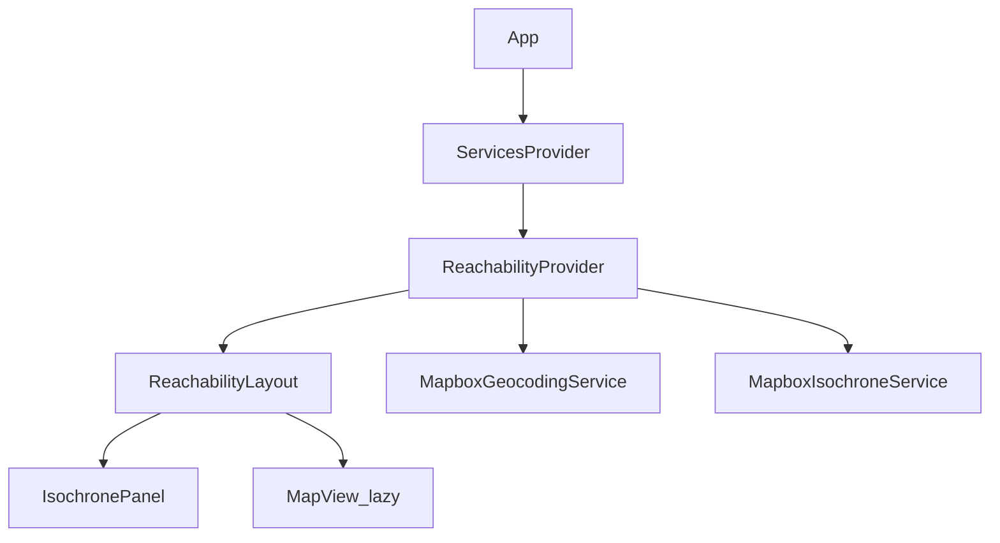
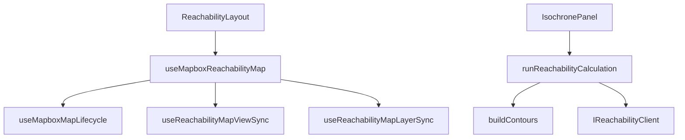

# Reachability architecture

This document gives the high-level system architecture of the isochrone (Reachability Map) project.

## Purpose and scope

Reachability Map is a **browser-based isochrone explorer**. Users search for a start location, choose a travel mode and time limits, and visualize how far they can travel on a Mapbox map. Results can be exported as GeoJSON or WKT.

This file covers:

- Repository shape and package roles
- End-to-end geocoding and isochrone calculation flow
- SPA module map (context, layout, map hooks, services)
- Bundle and lazy-loading strategy
- Hard invariants and verification

This file does **not** cover:

- Full setup and env copy steps — see [README.md](../../README.md)
- Folder layout and component layers — see [typescript-project-structure](../skills/typescript-project-structure/SKILL.md)
- Reachability UI and map hook details — see [reachability-web](../skills/reachability-web/SKILL.md)
- Visual system and design tokens — see [DESIGN.md](DESIGN.md)
- Agent index — see [AGENTS.md](../../AGENTS.md)

## System context

The browser is a single-page application that calls Mapbox directly for map tiles, forward geocoding, and isochrone contours. There is no backend BFF; the Mapbox public token is injected at build time via Vite env.

Runtime bar:

- Node.js `>=22`
- pnpm `11.8.0` (pinned via `packageManager`)
- Local development: Vite on `:5173`
- Required Mapbox token scopes: **Maps**, **Geocoding**, **Isochrone API**



## Repository packages

| Package | Role |
| ------- | ---- |
| [`apps/web`](../../apps/web) | Vite React SPA: settings panel, lazy Mapbox map, geocoding, isochrone calculation, export |

Root scripts orchestrate lint, test, build, skills validation, and React Doctor across the workspace.



## High-level calculation flow

A reachability calculation runs like this:

1. The user enters a location in `LocationSearch` (forward geocode suggestions or coordinate paste).
2. `useReachabilityOrigin` resolves the query into a `ReachabilityOrigin` (coordinates + label).
3. The user configures travel mode, time intervals, exclude options, depart-at, and contour smoothing in `IsochronePanel`.
4. On Calculate, `useReachabilityCalculation` calls `runReachabilityCalculation` with an `AbortSignal`.
5. `buildContours` validates unique, strictly increasing minute values and builds contour specs.
6. `MapboxIsochroneService` POSTs to the Mapbox Isochrone API and returns a `FeatureCollection`.
7. `computeBounds` derives map fit bounds; contours render on the map via layer sync hooks.
8. Export opens `ExportContoursModal` (lazy) and downloads via page-local download services.



## SPA composition

Entry: [`apps/web/src/index.tsx`](../../apps/web/src/index.tsx) mounts [`App`](../../apps/web/src/app.tsx).

`App` wires `createServices()` → `ServicesProvider` → `ReachabilityProvider` → `ReachabilityPage` → `ReachabilityLayout`.

| Area | Path | Role |
| ---- | ---- | ---- |
| Services DI | [`services/app-services.ts`](../../apps/web/src/services/app-services.ts) | `AppServices`: geocoding + reachability ports |
| Geocoding adapter | [`services/mapbox-geocoding-service.ts`](../../apps/web/src/services/mapbox-geocoding-service.ts) | Mapbox Geocoding v6 forward search |
| Isochrone adapter | [`services/mapbox-isochrone-service.ts`](../../apps/web/src/services/mapbox-isochrone-service.ts) | Mapbox Isochrone API client |
| Service ports | [`types/geocoding-service.types.ts`](../../apps/web/src/types/geocoding-service.types.ts), [`types/reachability-client.types.ts`](../../apps/web/src/types/reachability-client.types.ts) | `IGeocodingService`, `IReachabilityClient` |
| Reachability state | [`contexts/ReachabilityContext/`](../../apps/web/src/contexts/ReachabilityContext/) | Settings, origin, calculation, map state |
| Layout | [`pages/Reachability/ReachabilityLayout/`](../../apps/web/src/pages/Reachability/ReachabilityLayout/) | Panel + lazy `MapView` |
| Settings panel | [`pages/Reachability/components/IsochronePanel/`](../../apps/web/src/pages/Reachability/components/IsochronePanel/) | Location, modes, intervals, calculate |
| Map | [`pages/Reachability/components/MapView/`](../../apps/web/src/pages/Reachability/components/MapView/) | Mapbox GL; lazy-loaded |
| Core UI | [`components/core/`](../../apps/web/src/components/core/) | Button, Input, Modal, Spinner, … |
| Patterns | [`components/patterns/`](../../apps/web/src/components/patterns/) | Autocomplete, DateTimePicker |
| Styles | [`styles/global.css`](../../apps/web/src/styles/global.css) | Global theme (Sora) |

Context slices (prefer the narrow hook):

| Hook | Concern |
| ---- | ------- |
| `useReachabilityOrigin` | Search query, suggestions, origin coordinates |
| `useReachabilityCalculation` / `useReachabilityCalculationState` | Calculate, abort, result, errors |
| `useReachabilityMap` / `useReachabilityMapState` | Contours, bounds, map view |
| `useReachabilitySettingsState` | Travel mode, intervals, exclude, depart-at |
| `useReachability` | Full context for layouts that need everything |



## Reachability page module map

Page-local code lives under [`pages/Reachability/`](../../apps/web/src/pages/Reachability/).

| Area | Path | Role |
| ---- | ---- | ---- |
| Calculation orchestration | [`utils/run-reachability-calculation.ts`](../../apps/web/src/pages/Reachability/utils/run-reachability-calculation.ts) | Build request, call port, return result or error |
| Contour validation | [`utils/build-contours.ts`](../../apps/web/src/pages/Reachability/utils/build-contours.ts) | Unique increasing minute values |
| Map fit padding | [`utils/map-fit-padding.ts`](../../apps/web/src/pages/Reachability/utils/map-fit-padding.ts), [`hooks/use-map-fit-padding.ts`](../../apps/web/src/pages/Reachability/hooks/use-map-fit-padding.ts) | Panel-aware `fitBounds` insets |
| Map hooks | [`hooks/use-mapbox-map-lifecycle.ts`](../../apps/web/src/pages/Reachability/hooks/use-mapbox-map-lifecycle.ts), [`use-reachability-map-view-sync.ts`](../../apps/web/src/pages/Reachability/hooks/use-reachability-map-view-sync.ts), [`use-reachability-map-layer-sync.ts`](../../apps/web/src/pages/Reachability/hooks/use-reachability-map-layer-sync.ts) | Split map lifecycle, view, and layers |
| Export services | [`services/geojson-download-service.ts`](../../apps/web/src/pages/Reachability/services/geojson-download-service.ts), [`services/wkt-download-service.ts`](../../apps/web/src/pages/Reachability/services/wkt-download-service.ts) | Client-side file download |
| Constants | [`constants/travel-modes.constants.ts`](../../apps/web/src/pages/Reachability/constants/travel-modes.constants.ts), [`constants/reachability-layout.constants.ts`](../../apps/web/src/pages/Reachability/constants/reachability-layout.constants.ts) | Modes, breakpoints, UI copy |
| Help content | [`constants/reachability-help-content.ts`](../../apps/web/src/pages/Reachability/constants/reachability-help-content.ts) | User guide modal copy |



## Bundle and lazy-loading strategy

Mapbox GL is a large vendor dependency (~1.8 MB / ~502 KB gzip) and is kept out of the initial JavaScript payload.

| Boundary | Mechanism |
| -------- | --------- |
| `MapView` | `React.lazy` in `ReachabilityLayout` |
| `mapbox-gl` | Dynamic `import()` inside map hooks; prefetch in layout `useEffect` |
| `ExportContoursModal` | Lazy-loaded when user opens export |
| Vendor chunk | `vite.config.ts` `manualChunks` isolates `mapbox-gl` |

Approximate production gzip sizes (run `pnpm build` to refresh): app shell ~70 KB, `mapbox` vendor ~502 KB.

Analysis: `pnpm analyze:bundle` → `apps/web/dist/stats.html`.

## Hard invariants

| Invariant | Why |
| --------- | --- |
| Page-only Reachability code under `pages/Reachability/` | Clear ownership; shared UI stays in `components/` |
| No component-layer barrel files | Direct imports; tree-shaking and explicit deps |
| Top-level `constants/` (`mapbox.constants.ts` only) and `utils/` (DateTimePicker helpers only) | Prevent page logic leaking to app root |
| `utils/` and `constants/` must not import component `index.types` | Layer inversion guard |
| Depend on ports in `types/`; wire Mapbox in `services/app-services.ts` | DIP; testable with mocks |
| Contour minutes unique and strictly increasing | Mapbox Isochrone API requirement |
| Abort in-flight geocode/isochrone on unmount and re-calculate | Prevent stale state and React warnings |
| Stable `useRef` identities in map hook effect deps | React Doctor / correctness |
| `mapbox-gl` lazy-loaded; `MapView` behind `React.lazy` | Initial bundle size |

## Errors and contracts (high level)

- Geocoding: empty or short queries return no suggestions; HTTP failures surface as empty suggestions or logged errors per service.
- Calculation: `runReachabilityCalculation` returns a discriminated union (`ok: true` with `FeatureCollection` or `ok: false` with user-facing error string). Invalid intervals throw before the API call.
- Export: download services handle client-side blob creation; malformed geometry is guarded at export time.

Service port shapes: [`types/reachability-client.types.ts`](../../apps/web/src/types/reachability-client.types.ts), [`types/geocoding-service.types.ts`](../../apps/web/src/types/geocoding-service.types.ts).

## Verification and agent layout

Local verify commands (CI parity):

```bash
pnpm verify          # validate:skills + biome ci + test + build
pnpm doctor:full     # React Doctor full scan
pnpm doctor:changed  # React Doctor regression check
```

Targeted loops while editing:

```bash
pnpm validate:skills
pnpm --filter web exec vitest run <path>
pnpm exec biome ci <path>
```

Agent support lives under `.agents/`:

- `rules/` — TypeScript standards, workflow, Reachability/Mapbox, Biome, Vitest policy
- `skills/` — reachability-web, structure, SOLID, JSDoc, react-doctor, vitest-reachability
- `commands/` — `/isochrone-verify`, `/isochrone-doctor`, and related slash commands
- `hooks/` — Biome and React Doctor after file edit (registered in `.cursor/hooks.json`)
- `docs/` — this architecture file

See [AGENTS.md](../../AGENTS.md) for the full index.
